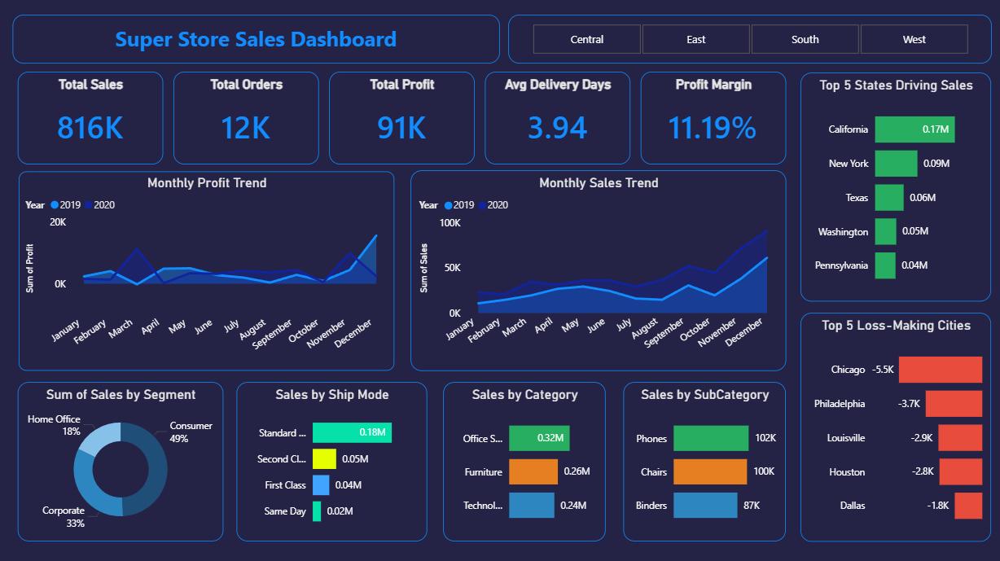
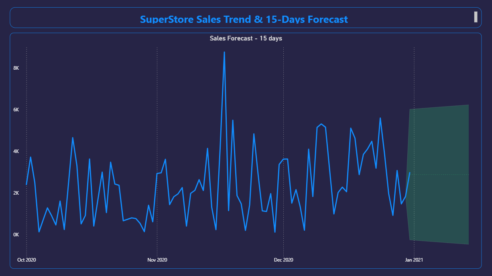

# 📊 Superstore Sales Dashboard & Forecast

## 🔍 Overview

This project is an interactive Power BI dashboard built to analyze sales performance and predict future trends.

## 📈 Features

* KPI metrics (Sales, Profit, Orders)
* Top-performing states analysis
* Loss-making cities identification
* Category and segment insights
* 15-day sales forecast

## 🛠 Tools Used

* Power BI
* DAX
* Data Visualization

## 📸 Dashboard Preview

## 📊 Forecast Preview

## 🎥 Demo Video  
[Click here to watch demo](./dashboard_demo.mp4)

## 🚀 Key Insights

* California drives the highest sales
* Some cities show negative profitability
* Sales trend shows seasonal patterns

## 📁 Files Included

* Power BI (.pbix file)
* Dashboard and forecast images
* Demo video

## 💡 Learning Outcome

This project helped me understand how to create interactive dashboards and apply forecasting techniques for business insights.
